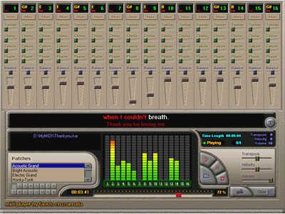



## Karaoke III

### Description

Karaoke and midiplayer, with a lot of functionalities.

This is the third version, and it doesn't use OCX, or DirectX.

To develop MIDI applications more easy,

you only will need of the "MIDI.DLL" (with source code included).

Compatible with *.MID and *.KAR files.

Also included a sample project with properties

and methods of this DLL.

Enjoy.
 
### More Info
 

             |
---                |---
**Submitted On**   |2002-06-04 22:13:24
**By**             |[Arruda](https://github.com/Planet-Source-Code/PSCIndex/blob/master/ByAuthor/arruda.md)
**Level**          |Intermediate
**User Rating**    |4.8 (222 globes from 46 users)
**Compatibility**  |VB 5\.0, VB 6\.0
**Category**       |[Sound/MP3](https://github.com/Planet-Source-Code/PSCIndex/blob/master/ByCategory/sound-mp3__1-45.md)
**World**          |[Visual Basic](https://github.com/Planet-Source-Code/PSCIndex/blob/master/ByWorld/visual-basic.md)
**Archive File**   |[Karaoke\_II90355642002\.zip](https://github.com/Planet-Source-Code/arruda-karaoke-iii__1-33003/archive/master.zip)

